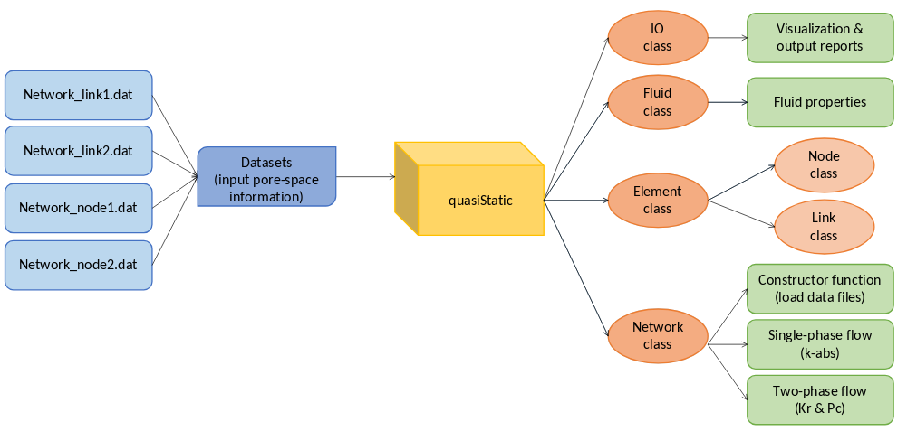
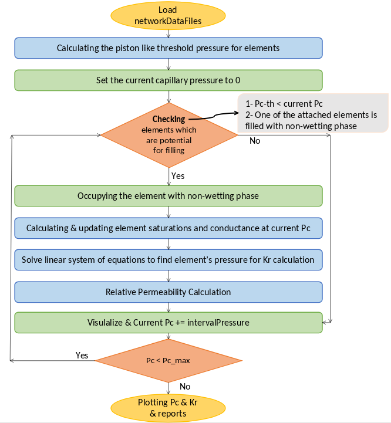

# What is MatlabPNM?

MatlabPNM is an open-source software developed for flow simulation at micro-scale through porous media using a quasi-static pore-network modelling approach. 
<p align="center">
  
</p>


## Code structure

### Quasi-static package graph
<p align="center">
  
</p>


## Algorithms of flow modelling

### Quasi-static drainage flowchart
<p align="center">
  
</p>

### Quasi-static imbibition flowchart
<p align="center">
  
</p>

## Installation
* Download the reposity as a zip file. For the latest release, please check [releases page](https://github.com/mhgolestan/MatlabPNM/releases/) for available downloads.
* Extract the zip archive on your computer.

### MATLAB installation
User has access to MATLAB version 2016 or higher. The code does not require any scpecific toolbox to be installed.


## Working with the software
The MatlabPNM comes in two versions, the basic and the advanced (OOP) versions. The advanced version has the advantage of OOP which allows simulating big networks like common pore network data of Berea sandstone.  

## How to run?
You can run the main script from the command-line using
```
matlab main.m
```

### Input data
Data must be structured following statoil protocol. A template is already provided in the package datasets directory.
<!-- TODO -->


### Output 
The results will be saved in the selected output folder. 
<!-- TODO -->
